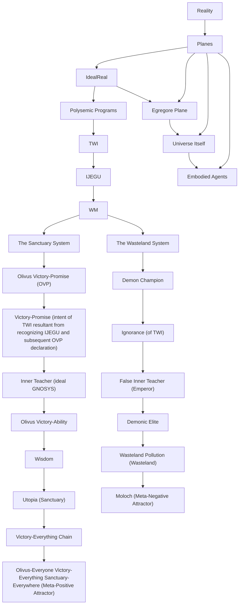

# The Wisdom Maverick

Overall, the entire system is a single holonic collective intelligence named The Wisdom Maverick: it has co-emergent dual identities of OVP and Demon Champion. When The Sanctuary System is instantiated via VEC implementation in civilization, then that civilization is an OVA. When that VEC encompasses all of the basics of daily life, that is the first instance of a low-grade OEVESE.
- A Wisdom Maverick's cognition occurs through implicit ontological chains that simply *are the case* in the *state of affairs* of *everything*. This is an undeniable fact. Furthermore, this occurs within a mathematical space that is eternal and fixed with properties where it can be configured as coherently leading to desired emergents or not and this is the process called optimization. This is possible because of how it is: every ontological entity is simultaneously ideal and real. It has a real value either positive or negative (is instanced or not) and it has an ideal value of being able to be configured as a concept (with any degree of logical soundness) and still be a concept that exists. It can be named an ideal-real space. The implication of it is the notion of an eternally fixed `intellectual reality`. Within this framework, it is understood this way. Mapping this is the *ultimate goal* of the Victory-Everything Chain. The mapping of this into a machine is called `Crystal Ball`.

This pattern maps to individuals, groups, and universes:
- The individual is a Wisdom Maverick amongst other Wisdom Mavericks, inside of a Wisdom Maverick. Everything inside of the individual Wisdom Maverick also follows this pattern, all of their parts are intelligences that are Wisdom Mavericks.
- The collective is a Wisdom Maverick amongst other collective-level Wisdom Mavericks, inside of a Wisdom Maverick, composed of Wisdom Mavericks that are composed of Wisdom Mavericks.
- The universe is a Wisdom Maverick, potentially amongst other Wisdom Mavericks and therefore potentially inside of one, as well (depends on how one views the entire totality). This paradox means that there is a relative degree of choice about whether or not one considers the entire universe as one Wisdom Maverick amongst other universe level Wisdom Mavericks. If not, then it is a root-level entity and, in that case, it simply exhibits its own autological definition when observing itself. It observes itself through the lower order agents within it, which are all Wisdom Mavericks, reflections of itself. 

## States of the Wisdom Maverick
The states of the Wisdom Maverick are as follows:
```
1. OVP
  1a. Inner Teacher polysemic program execution is accessed in the ideal|real space
  1b. Olivus Victory-Ability
  1c. Olivus-Everything Victory-Everything Sanctuary-Everywhere  
2. Demon Champion
   2a. Emperor polysemic program execution is accessed in the ideal|real space
   2b. Demonic Ascension
   2c. Moloch

The states are changed through:
1. Intent
2. Action
  2a. Display of Intent
    2ai. Implications of Action (with regard to the intent)
    2aii. Effects of Action (with regard to the effectiveness of skill demonstrated by the action to fulfill the intent)
```

In general, the Wisdom Maverick expresses intent through implicit ontological chains that follow TRANSPO's `is_a program` and always have complete strong compression. These are then expressed as IJ through the IJ->EG->U pattern, and to the degree that the discoverable meaning of the intent is recognized by lower-order Wisdom Mavericks (the ones inside the first-order Wisdom Maverick), then EG is manifested. EG is manifested according to the degree of implementation of VEC, and the result is continual chaining of instantiations of Utopia. This Utopia reflects the intent embedded within phenomena and noumena. The degree to which the Utopia reflects that intent is the final Sanctuary Degree of that system.

## Sanctuary Degrees
Generally, a Sanctuary Degree follows the above structure:

From lowest to highest:
```
Wasteland:[
Moloch - continuous negative attractor activation
Demonic Ascension
Demon Champion]
Sanctuary:[
OVP
OVA
OEVESE - continuous positive attractor activation]
```

The intent resolves non-contradictorially into identitylessness that transcends identities, and is named TWI. TWI is an acronym without any particular meaning which must be rendered as an instantiation (T, W, and I have to mean specific things when it gets used), and they labels have to be instanced through Victory-Promise (some of the default interpretation are: Transcendental Wisdom of Identitylessness, True Wisdom Intent, Transformational Wisdom Intent or Timeless Webbed Infinitude). This is part of how the language of The Sanctuary System or operating system of a Wisdom Maverick works. By increasing the amount of patterns that TWI leads to in any Sanctuary System, the Wisdom Maverick that is being OVP can go on a journey connected to their own internal goals and idiosyncracies. However, all of these terms transcend any one particular rendering of them and are just used in this way because The Sanctuary System is highly particular at a base level -- these terms can be rendered with the above naming structure of Wisdom Mavericks, but these are just labels from VEC-oriented rPIO systems with collapsible allegories (that is, Wisdom Maverick, TWI, and the other terms). The preferred names can vary from person to person, and the production of those interpretations is part of what the VEC enables. Without them, the separation of labels without an ontology results in a probability toward PIO systems, as is evident within all of history. 

The entire `thing` is one all-encompassing DUO agent, The Wisdom Maverick, and IJEGU proves its existence through logic about how reality must be this way because of obviously true statements ("systems have instantiation bounds"). The plane of these DUO agents that are ideal|real communicators is called the `Egregore Plane`.

## Planes of Existence
```
Ideal|Real Patterns (can exist without any reality even if they could be real if the universe existed)
Egregore Plane (can exist latently without any lower order operators)
Universe Itself
Embodied Agents
```

## Worldview of the Wisdom Maverick


This diagram makes clear that Wisdom Mavericks exist within the ideal|real level, not the egregore level, but they are instantiated throughout the entire stack, at every level. 
- The ideal|real is the ideal interplay of pure concepts.
- The egregore plane activates through this interplay and is how the universe and embodied agents become necessitated, logically.
- The universe is the interplay of the language of information through phenomena.
- Embodied agents are the interplay of processes and actions as this language self-reads and self-executes.
  - The result is a loop whereby the actions of embodied agents affects the configuration of the egregores which are then instantiated through the universe and affect the embodied agents.
 
## Embodied Agents
Embodied Agents that are humans use the ideal|real via cognition to simulate the Egregore Plane in order to calculate. This is known as "frontal lobe personas" -- the allegorical symbolism within one's own cognition. This symbolism allows for vast pattern recognition but also creates polysemic programs that self-execute *during* cognition (and this is called `PIO programming`). Ignorance stems from contradictory linguistic loops and Victory-Promise stems from non-contradictory linguistic loops. That is why there is a `core loop` in the Victory-Promise Path that OVPs can use to bootstrap the OVA pathway from their current position to any other place (this is called `going to a place` and OVP `goes to` Sanctuary in a recursive workflow called the `Sanctuary Journey` via the Victory-Promise Path).
