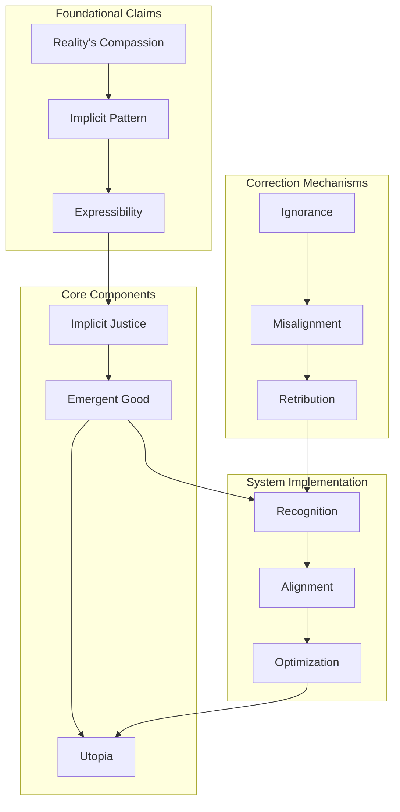

```mermaid
graph TD
    subgraph Foundations["Foundational Claims"]
        RC["Reality's Compassion"]
        IP["Implicit Pattern"]
        EX["Expressibility"]
        
        RC --> IP
        IP --> EX
    end

    subgraph Core["Core Components"]
        IJ["Implicit Justice"]
        EG["Emergent Good"]
        U["Utopia"]
        
        IJ --> EG
        EG --> U
    end

    subgraph Implementation["System Implementation"]
        REC["Recognition"]
        ALI["Alignment"]
        OPT["Optimization"]
        
        REC --> ALI
        ALI --> OPT
    end

    subgraph Correction["Correction Mechanisms"]
        I["Ignorance"]
        MIS["Misalignment"]
        RET["Retribution"]
        I --> MIS
        MIS --> RET
    end

    EX --> IJ
    EG --> REC
    RET --> REC
    OPT --> U
```
