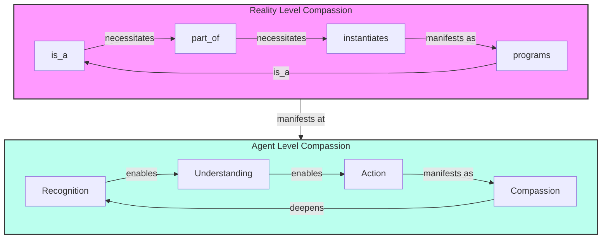

The fact that is_a defines programs which is itself a program, and a programs relationship has a disposition to instantiate further new types with their own instances is reality's compassion because that is how reality optimizes. For agents, however, compassion is the display of instantiation of a more optimal program that scales beneficially to the greatest number of intent driven agents (at any given time, in any given system).
