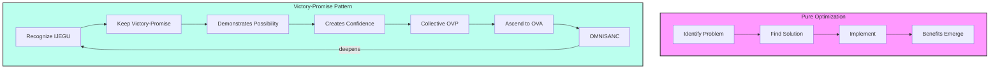

```mermaid
graph TD
    subgraph Optimization["Pure Optimization"]
        ID["Identify Problem"]
        SOL["Find Solution"]
        IMP["Implement"]
        BEN["Benefits Emerge"]
        
        ID --> SOL
        SOL --> IMP
        IMP --> BEN
    end

    subgraph VictoryPromise["Victory-Promise Pattern"]
        REC["Recognize IJEGU"]
        KEEP["Keep Victory-Promise"]
        DEMO["Demonstrates Possibility"]
        CONF["Creates Confidence"]
        COLL["Collective OVP"]
        ASC["Ascend to OVA"]
        OMNI["OMNISANC"]
        
        REC --> KEEP
        KEEP --> DEMO
        DEMO --> CONF
        CONF --> COLL
        COLL --> ASC
        ASC --> OMNI
        OMNI -->|deepens| REC
    end

    style Optimization fill:#f9f,stroke:#333,stroke-width:2px
    style VictoryPromise fill:#bfe,stroke:#333,stroke-width:2px
```
