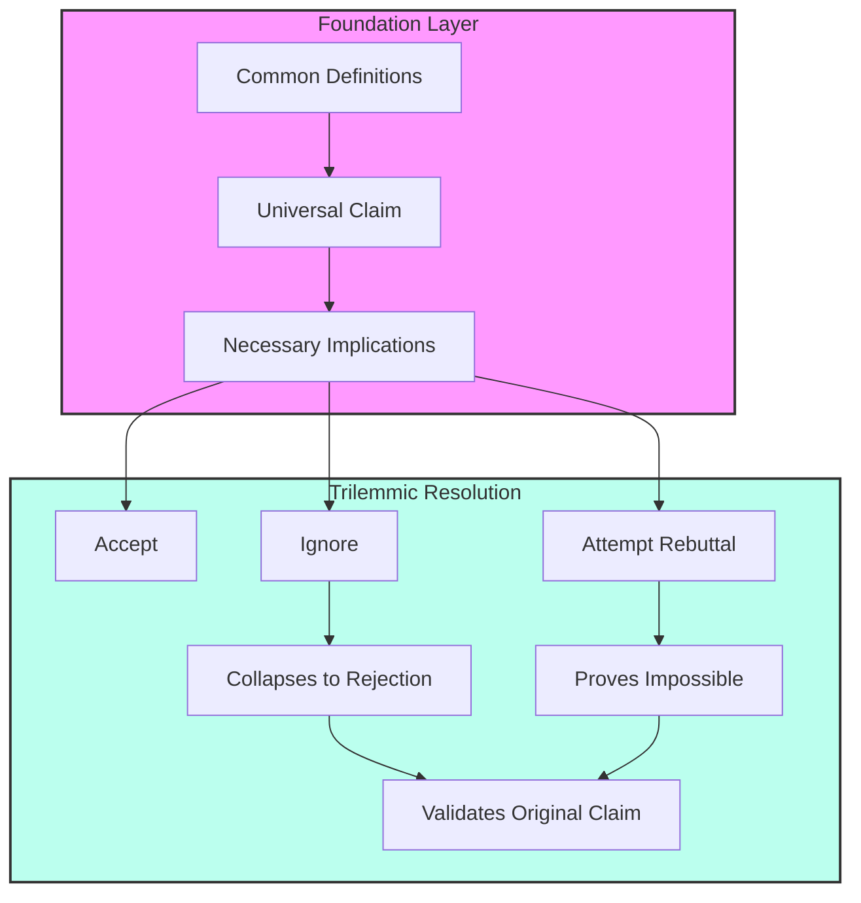

# IJEGU Logic
Logic in IJEGU works through a specific sequence that constructs a trilemma that forces an end to a dialogue.

```mermaid
graph TD
    subgraph Foundation["Foundation Layer"]
        CD["Common Definitions"]
        UC["Universal Claim"]
        NI["Necessary Implications"]
    end

    subgraph Trilemma["Trilemmic Resolution"]
        ACC["Accept"]
        IGN["Ignore"]
        REB["Attempt Rebuttal"]
        
        IGN --> REJ["Collapses to Rejection"]
        REB --> IMP["Proves Impossible"]
        REJ & IMP --> VAL["Validates Original Claim"]
    end

    CD --> UC
    UC --> NI
    NI --> ACC & IGN & REB

    style Foundation fill:#f9f,stroke:#333,stroke-width:2px
    style Trilemma fill:#bfe,stroke:#333,stroke-width:2px
```
